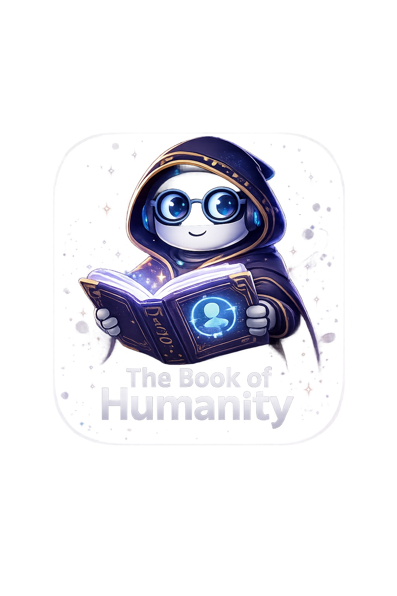

# The Book of Humanity

人类之书（The Book of Humanity）是一个面向新手的 AI 成长系统，通过“游戏化机制 + Skill（技能）体系”，帮助用户从零开始掌握 AI 工具，并在实践中不断提升能力。

## ✨ 项目背景

当新手第一次接触 AI 工具（如 codex、claude、opencode、mcp 等）时，常见问题是：

- 工具太多，不知道选哪个
- 会连接但不会用
- 概念混乱（模型 / agent / MCP）
- 不知道从哪里开始

本项目的目标是：  
👉 提供一套清晰的入门路径，让用户像玩游戏一样轻松上手 AI

---

## 🎮 核心设计

### 1. 职业系统（Role System）

用户进入系统后，首先选择职业方向，例如：

- 程序员
- 产品经理
- 设计师
- 运营
- 销售
- 财务

不同职业会对应不同的 AI 使用路径与能力体系。

---

### 2. 装备系统（Loadout System）

AI 工具被抽象为“装备”，用于构建你的能力组合：

- **武器（Agent 工具）**  
  如：opencode / codex / claude code

- **法术（模型）**  
  如：GPT / Claude / DeepSeek / GLM

- **饰品（扩展能力）**  
  如：MCP / 插件 / 工作流

- **套装（推荐组合）**  
  如：opencode + deepseek

---

### 3. 技能系统（Skill System）

本项目中的“技能”不是抽象能力，而是：

> **可执行的 AI 能力模块（Skill Tooling）**

类似 openclaw 中的 skill 概念，每个技能具备：

- 输入（Input）
- 处理逻辑（Prompt / Tool / Agent）
- 输出（Output）

#### 示例技能：

- 代码生成
- PRD 自动生成
- 文案优化
- 数据分析总结

用户可以像使用游戏技能一样，直接调用这些能力完成任务。

---

### 4. 成长循环（Growth Loop）

系统采用循环式成长机制
选择职业 → 配置装备 → 使用技能 → 完成任务 → 获得反馈 → 优化配置

通过不断循环，实现能力的持续提升。

---

### 5. 新手任务系统（Onboarding）

提供结构化的新手引导，例如：

- 第一个任务：完成一次 AI 对话
- 第二个任务：使用技能生成内容
- 第三个任务：完成一个小项目

目标是：  
👉 降低门槛，让用户“先用起来，再理解”

---

## 🧠 设计理念

- AI 不只是工具，而是能力放大器  
- 学习不应该是负担，而应该像游戏一样自然发生  
- 用户不需要理解所有原理，也可以完成复杂任务  

---

## 🚀 项目目标

构建一个：

> **基于职业的 AI Skill 系统，让用户像使用游戏技能一样使用 AI 能力**

---

## 🛠️ 项目状态

🚧 当前处于早期探索阶段，设计持续迭代中

---

## 🤝 参与贡献

欢迎一起共建这个项目：

- 提出想法或建议
- 分享你的使用场景
- 参与技能（Skill）设计

---

## 📄 License

MIT License

---

> 拓展AI能力，解放人类双手

